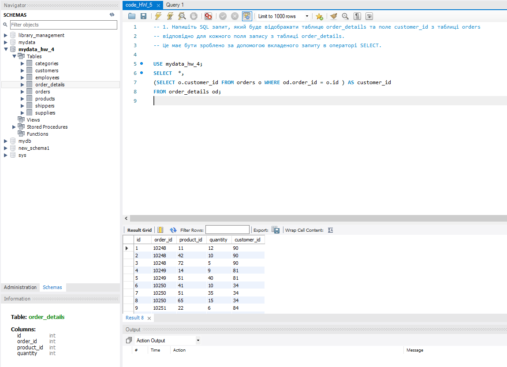
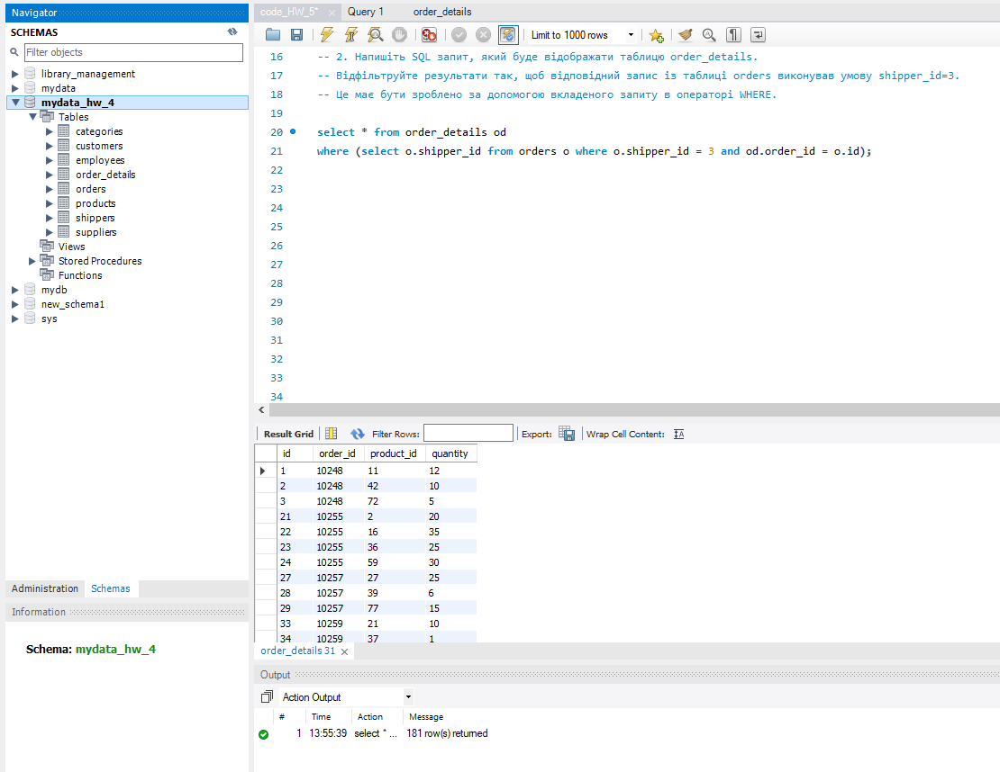
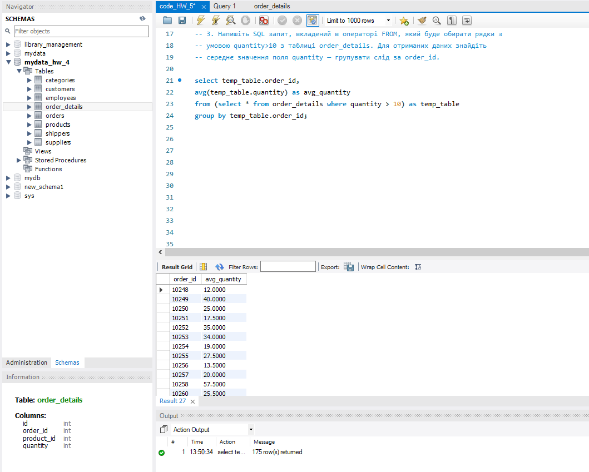

# DML and DDL commands. Complex SQL expressions

1. Створіть базу даних для керування бібліотекою книг згідно зі структурою.
   Використовуйте DDL-команди для створення необхідних таблиць та їх зв'язків.

2. Заповніть таблиці простими видуманими тестовими даними. Достатньо одного-двох рядків у кожну таблицю.

3. Перейдіть до бази даних, з якою працювали у темі 3.
   Напишіть запит за допомогою операторів FROM та INNER JOIN,
   що об’єднує всі таблиці даних, які ми завантажили з файлів:
   order_details, orders, customers, products, categories, employees, shippers, suppliers.
   Для цього ви маєте знайти спільні ключі. Перевірте правильність виконання запиту.

4.1 Визначте, скільки рядків ви отримали (за допомогою оператора COUNT).

4.2 Змініть декілька операторів INNER на LEFT чи RIGHT.
Визначте, що відбувається з кількістю рядків. Чому? Напишіть відповідь у текстовому файлі.

4.3 Оберіть тільки ті рядки, де employee_id > 3 та ≤ 10.

4.4 Згрупуйте за іменем категорії, порахуйте кількість рядків у групі,
середню кількість товару (кількість товару знаходиться в order_details.quantity).

4.5 Відфільтруйте рядки, де середня кількість товару більша за 21.

4.6 Відсортуйте рядки за спаданням кількості рядків.

4.7 Виведіть на екран (оберіть) чотири рядки з пропущеним першим рядком.

